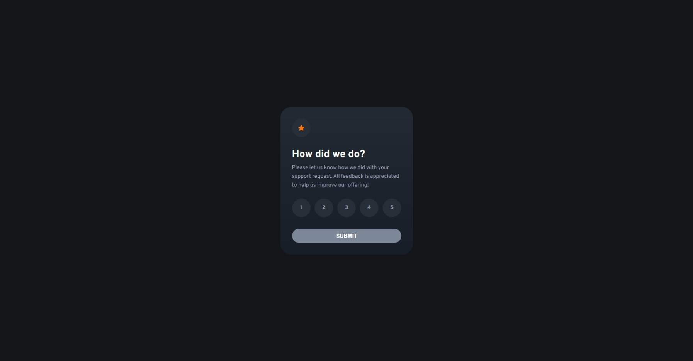

# Frontend Mentor - Interactive rating component solution

This is a solution to the [Interactive rating component challenge on Frontend Mentor](https://www.frontendmentor.io/challenges/interactive-rating-component-koxpeBUmI). Frontend Mentor challenges help you improve your coding skills by building realistic projects.

## Table of contents

- [Overview](#overview)
  - [The challenge](#the-challenge)
  - [Screenshot](#screenshot)
  - [Links](#links)
- [My process](#my-process)
  - [Built with](#built-with)
  - [What I learned](#what-i-learned)
  - [Continued development](#continued-development)
  - [Useful resources](#useful-resources)
- [Author](#author)

## Overview

### The challenge

Users should be able to:

- View the optimal layout for the app depending on their device's screen size
- See hover states for all interactive elements on the page
- Select and submit a number rating
- See the "Thank you" card state after submitting a rating

### Screenshot



### Links

- [Solution](https://www.frontendmentor.io/solutions/interactive-rating-component-react-typescript-48AW1x6k4d)
- [Live site](https://yiaoma.github.io/interactive-rating-component/)

## My process

### Built with

- Semantic HTML5 markup
- CSS custom properties
- Flexbox
- Mobile-first workflow
- [TypeScript](https://www.typescriptlang.org/) - strict syntactical superset of JavaScript
- [React](https://reactjs.org/) - JS library
- [Styled Components](https://styled-components.com/) - For styles

### What I learned

Creating custom radio button component using theme and custom data property.

```
  interface RadioProps {
    name: string;
    value: string | number;
    children: string;
    className?: string;
    checked: string | number;
    onChange: (event: ChangeEvent<HTMLInputElement>) => void;
  }

  export const Radio: FC<RadioProps> = ({
    className,
    name,
    value,
    onChange,
    checked,
    children,
  }) => (
    <label className={className} data-checked={checked == value}>
      <input type="radio" name={name} value={value} onChange={onChange} />
      <span>{children}</span>
    </label>
  );

  <StyledRadio
    name="rating"
    value={1}
    checked={rating}
    onChange={(event) => handleRating(event)}
  >
    1
  </StyledRadio>

  export const StyledRadio = styled(Radio)`
    &[data-checked='true'] {
    color: ${({ theme }) => theme.colors.pureWhite};
    background-color: ${({ theme }) => theme.colors.orange};
    }
  `
```

### Continued development

In future development I would like to learn more about CSS Grid, TypeScript, Theming and Custom Hooks.

### Useful resources

- [React architecture directory structure](https://www.taniarascia.com/react-architecture-directory-structure/) - This blog helped me in structuring react project.

## Author

- Frontend Mentor - [@Yiaoma](https://www.frontendmentor.io/profile/Yiaoma)
